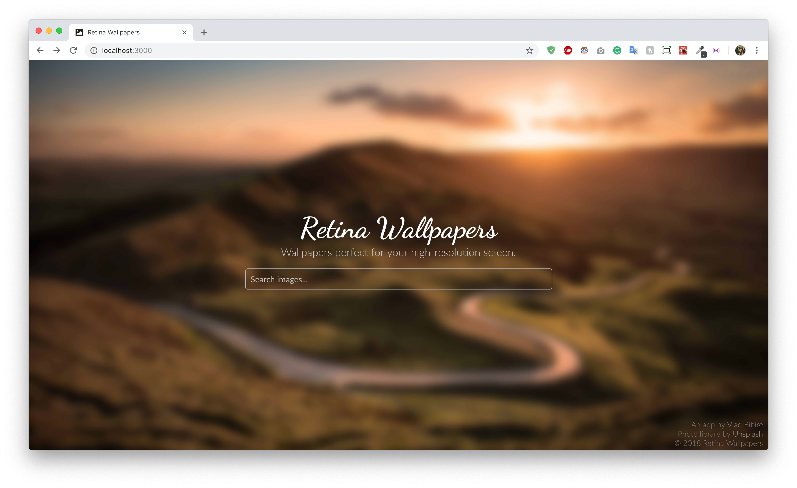
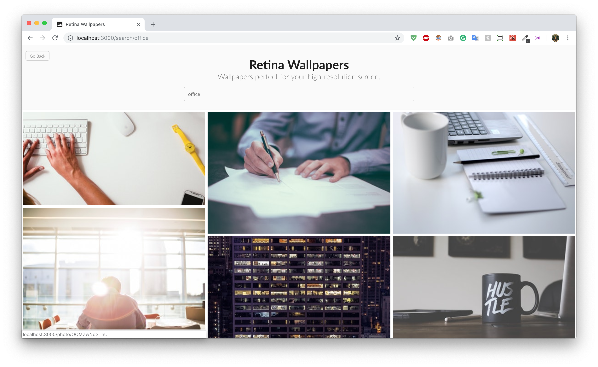
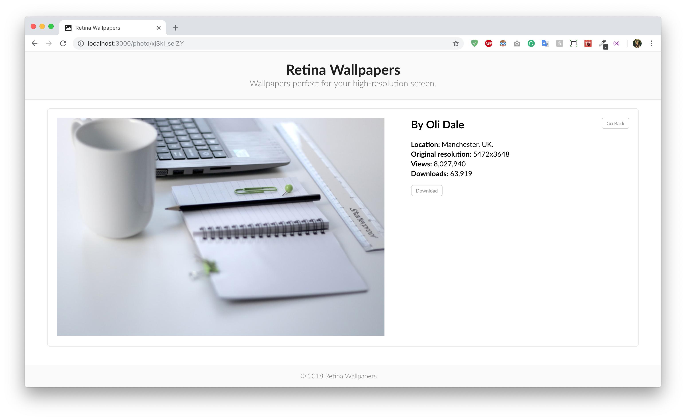

# Retina-Wallpapers
### Description
Retina Wallpapers is a Front-End React based application that generates ultra high quality images recived from [Unsplash API](https://api.unsplash.com).

### Functionality
It is based on 3 pages: **Landing**, **Search Page** and **Download Page**. Each Page and Each Search incorporates a **dynamic link** generated without refreshing the page using **React Router** library. The app was build using a modular style based on React components. Styling was done using **SASS** extension and for a better workflow and file optimisation, **Gulp.js**.

## Preview

### System Preparation
If you want to use this app, you need to have installed the following:
1. Node.js
3. Gulp.js @ 3.9.1

### Development Mode
1. Clone this repository into your machine. 
2. Inside directory run `npm start` to start the React App. 
3. To modify the SASS files run `gulp`.

